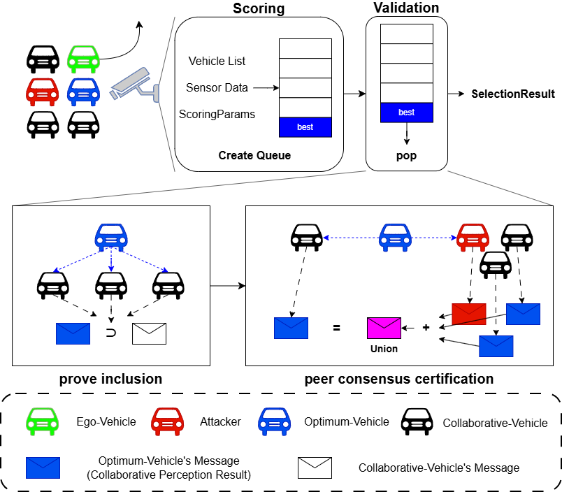

# EgoLoc(Ego-vehicle based on Location)




### 파일 구조

```
ego_selector/
  __init__.py
  types.py
  scoring.py
  priority_queue.py
  validator.py
  selector.py
  adapters/
    __init__.py
    dataset_adapter.py

examples/
  select_ego.py

ROBOSAC/
  ...

EgoLoc.yaml
```

### 빠른 시작
```bash
# 기본 JSON 샘플 예제 (내장 샘플 파일 사용)
python -m examples.select_ego

# V2X-Sim에서 선택 실행 (기본 경로/파라미터)
python -m examples.select_ego --mode v2x-sim

# 공격 시나리오
python -m examples.select_ego --mode v2x-sim --attack {subtle, adaptive}
```

### 주의 사항

```
1. 아래의 위치에 데이터셋을 첨부해야 함
첨부 방식과 다운로드 링크는 ROBOSAC의 README.txt를 참고
ROBOSAC\coperception\coperception\datasets\

2. 아래의 위치에 모델 체크포인트를 첨부해야 함
첨부 방식과 다운로드 링크는 ROBOSAC의 README.txt를 참고
ROBOSAC\coperception\ckpt\meanfusion\

3. yaml 파일을 통해 환경을 다운받아야 함
```
